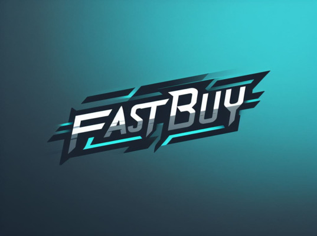
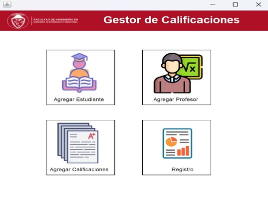
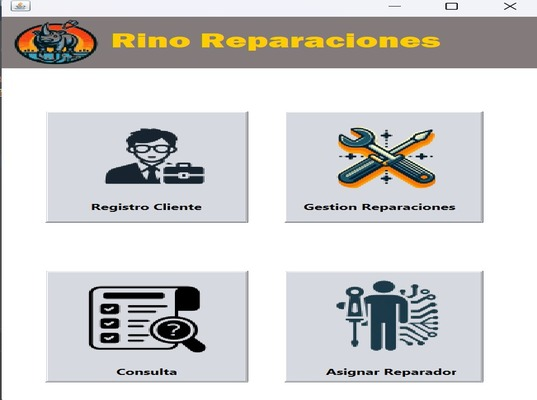
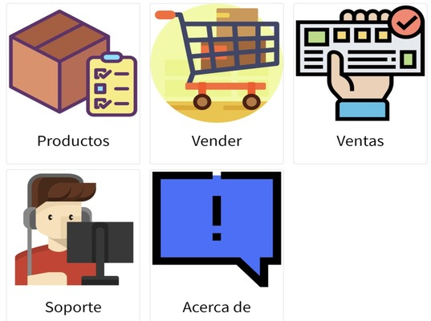

<h1 align="center">Hola 👋Yo Soy Christian Hurtado  ✨ </h1> 

        
    

<!--
**HurtadoChristian/HurtadoChristian** is a ✨ _special_ ✨ repository because its `README.md` (this file) appears on your GitHub profile.

Here are some ideas to get you started:

- 🔭 I’m currently working on ...
- 🌱 I’m currently learning ...
- 👯 I’m looking to collaborate on ...
- 🤔 I’m looking for help with ...
- 💬 Ask me about ...
- 📫 How to reach me: ...
- 😄 Pronouns: ...
- ⚡ Fun fact: ...
-->
<!--Intro start-->
## Acerca de mí
¡Hola! Soy un entusiasta del desarrollo de software con una amplia experiencia en diversas tecnologías ⚡. Desde la conceptualización de algoritmos hasta la creación de experiencias de usuario innovadoras 😄.

- 🚀 Me especializo en el desarrollo Frontend, trabajando con React  para crear interfaces de usuario intuitivas y atractivas. También tengo experiencia en el desarrollo de aplicaciones móviles con Flutter y Swift para iOS.
- 💡 Soy un experto en la gestión de datos, utilizando bases de datos como MySQL, MongoDB, y Firebase para almacenar y manipular información de manera eficiente.
- 🔧 Tengo habilidades sólidas en el desarrollo Backend, utilizando Node.js, Django y Laravel para crear robustas APIs RESTful y sistemas escalables.
- 💬 Me apasiona resolver problemas y crear soluciones centradas en el usuario.

## Habilidades
- **Lenguajes de Programación**: JavaScript, TypeScript, Python, Swift, Dart, Java, Kotlin, HTML, CSS, SQL. 🚀
- **Frameworks y Tecnologías**: React, Angular, Flutter, Node.js, Django, Laravel, .NET. 🔧
- **Bases de Datos**: MySQL, SQLite, Firebase, MongoDB. 💡

🎓 ESTUDIANTE DE SOFTWARE

💻 unos cuántos años de experiencia en el proceso de desarrollo de software

📝 roles en el ámbito: desarrollador... programador freelance... y en un futuro quién sabe ☺️

📫 Contacto: **hurtado.christian@gmail.com**
<!--Intro end-->
  

 
 <h2 >Proyectos</h2>

<table>
<tr>
<td width="50%">
  <h3 align="center">Tienda de Productos Tecnologicos Fastbuy</h3>
  

    </a>
        
Desarrollando una <strong>Aplicación Web para el Frontend de una Tienda de Productos Tecnológicos</strong> - Este proyecto implica la creación de una interfaz para la aplicación web de una tienda. Incluye funcionalidades y elementos de diseño diseñados específicamente para el entorno tecnológico, brindando una experiencia optimizada para los usuarios interesados en adquirir productos tecnológicos de manera rápida y eficiente.

  
                
</td>

<td width="50%">
  <h3 align="center">Gestor de Calificacion</h3>
  

    </a>
            
Desarrollando una <strong>Aplicación Web para el Frontend de un Gestor de Calificaciones</strong> - Este proyecto implica la creación de una interfaz para la aplicación web de un gestor de calificaciones. Incluye funcionalidades y elementos de diseño diseñados específicamente para el entorno educativo, brindando una experiencia optimizada para los usuarios interesados en gestionar y evaluar calificaciones de manera rápida y eficiente.

  
                
</td>

</table>   
<table>
<tr>
</td>

<td width="50%">
  <h3 align="center">Gestor de Clientes</h3>
  

    </a>
            
Desarrollando una <strong>Aplicación Web para el Frontend de un Gestor de Clientes de un Centro de Reparaciones</strong> - Este proyecto implica la creación de una interfaz para la aplicación web de un gestor de clientes de un centro de reparaciones. Incluye funcionalidades y elementos de diseño diseñados específicamente para el entorno de servicio técnico, proporcionando una experiencia optimizada para los usuarios interesados en gestionar clientes, reparaciones y seguimiento de servicios de manera eficiente y efectiva.

  
                
</td>

</td>

<td width="50%">
  <h3 align="center">Gestor de Tienda</h3>
  

    </a>
            
Desarrollando una <strong>Aplicación Web para el Frontend de un Gestor de Tienda</strong> - Este proyecto implica la creación de una interfaz para la aplicación web de un gestor de tienda. Incluye funcionalidades y elementos de diseño diseñados específicamente para el entorno de ventas minoristas, brindando una experiencia optimizada para los usuarios interesados en gestionar inventario, ventas y clientes de manera eficiente y efectiva.

  
                
</td>
</table>   

<h2 >Tecnologías conocidas👨🏻‍💻</h2>

<!--- stats & Trophy (start) -->

  <!--- stats (start) -->
<table align="center">
<tr border="none">
<td width="60%" align="center">

   
            </td>

<td width="40%" align="center">

  

  </td>
</tr>
</table>
<!--- stats (end) -->

<!--- trophy (start) -->

        
    

<!--- trophy (start) -->

        
<!--- stats (end) -->
⚙️ &nbsp;GitHub Analytics

